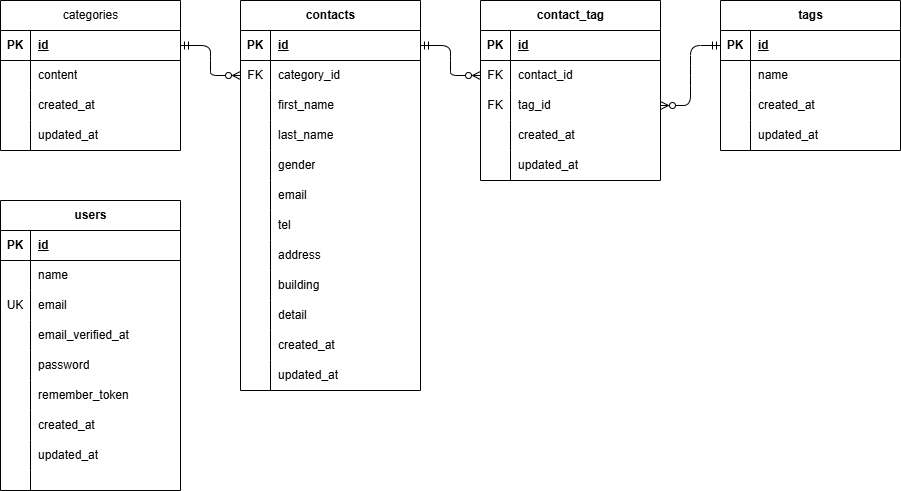

# プロジェクト名
COACHTECH お問い合わせフォーム開発プロジェクト（確認テスト）

## 概要
本プロジェクトは、一般ユーザーからのお問い合わせを受け付けるフォーム機能、および管理者が送信されたお問い合わせデータを閲覧・検索できる管理システムを統合したWebアプリケーションです。

## 使用技術
- **フレームワーク**: Laravel 10.x
- **データベース**: MySQL 8.0
- **Webサーバー**: Nginx
- **開発環境**: Docker / Laravel Sail (WSL 2環境にて動作確認済み)
- **フロントエンド**: Bladeテンプレート / Vite (CSS, JS)

## 開発環境URL
- **一般ユーザー向け（入力画面）**: http://localhost
- **管理者向け管理画面**: http://localhost/admin
- **管理者登録画面**: http://localhost/register
- **ログイン画面**: http://localhost/login
- **データベース管理（phpMyAdmin）**: http://localhost:8080

## 環境構築手順
本アプリケーションをローカル環境で起動するための手順。

1. **リポジトリのクローン**
   ```bash
   git clone git@github.com:taiga-takeda/contact-form-app.git
   cd contact-form-app
   ```

2. **環境設定ファイルの準備**
   `.env.example` をコピーして `.env` を作成します。
   ```bash
   cp .env.example .env
   .envに下記項目を設定してください
   DB_CONNECTION=mysql
   DB_HOST=mysql
   DB_PORT=3306
   DB_DATABASE=laravel
   DB_USERNAME=sail
   DB_PASSWORD=password
   ```

3. **Laravelパッケージのインストール**
   ```bash
    docker run --rm \
        -u "$(id -u):$(id -g)" \
        -v "$(pwd):/var/www/html" \
        -w /var/www/html \
        laravelsail/php82-composer:latest \
        composer install --ignore-platform-reqs
   ```

4. **Dockerコンテナの起動（Laravel Sail）**
   ```bash
   ./vendor/bin/sail up -d
   ```

5. **依存パッケージのインストール**
   ```bash
   ./vendor/bin/sail composer install
   ./vendor/bin/sail npm install
   ```

6. **アプリケーションキーの生成**
   ```bash
   ./vendor/bin/sail artisan key:generate
   ```

7. **データベースのマイグレーションと初期データ投入**
   ```bash
   ./vendor/bin/sail artisan migrate:fresh --seed
   ```

8. **フロントエンド資産のビルド（Viteの起動）**
   ```bash
   ./vendor/bin/sail npm run dev
   ```

## ER図


## テスト実行
```
./vendor/bin/sail artisan test
```

## APIエンドポイント一覧
今回の基本要件に基づいて実装されたWebアプリケーションのエンドポイント一覧です。

| HTTPメソッド | URI | 説明 | 認証 |
| :--- | :--- | :--- | :---: |
| **GET** | `/api/v1/contacts` | お問い合わせ一覧取得（検索・ページネーション対応） | 不要 |
| **GET** | `/api/v1/contacts/{contact}` | お問い合わせ詳細取得（カテゴリ・タグ含む） | 不要 |
| **POST** | `/api/v1/contacts` | お問い合わせ新規作成 | 不要 |
| **PUT** | `/api/v1/contacts/{contact}` | お問い合わせ更新 | 不要 |
| **DELETE** | `/api/v1/contacts/{contact}` | お問い合わせ削除 | 不要 |

## 作成者
武田大河
